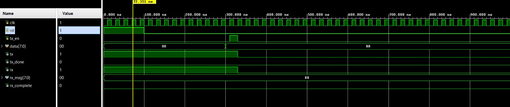

# UART Communication Protocol (Verilog)

## Overview

This project implements a UART (Universal Asynchronous Receiver/Transmitter) communication protocol using Verilog HDL in AMD Vivado. It demonstrates serial data transmission and reception between UART Transmitter (TX) and Receiver (RX) modules using asynchronous communication.

---

## Objective

* Understand UART communication protocol
* Implement UART Transmitter and Receiver
* Design FSM-based control system
* Achieve reliable serial data transfer

---

## Working Principle

UART is an asynchronous serial communication protocol, meaning no shared clock is used between transmitter and receiver.

Data is transmitted in frames consisting of:

* 1 Start Bit
* 8 Data Bits
* 1 Stop Bit

### Data Flow:

* Transmitter sends data serially (bit-by-bit)
* Receiver samples incoming data at precise time intervals
* Synchronization is achieved using a predefined baud rate

---

## Tools Used

* Verilog HDL
* AMD Vivado (Simulation)

---

## Project Structure

* `src/` → UART TX and RX design files
* `tb/` → Testbench
* `simulation/` → Waveform output

---

## How to Run (Vivado)

1. Open AMD Vivado
2. Create a new project
3. Add design files from `src/`
4. Add testbench from `tb/`
5. Run simulation

### Observe in Waveform:

* Start bit detection
* Serial data transmission (TX)
* Data reception (RX)
* Stop bit validation
* Bit-by-bit shifting of data

---

## Results

### UART Communication Waveform

The simulation verifies correct UART transmission and reception with proper framing.

---

## Challenges Faced

* Achieving accurate baud rate timing
* Synchronizing asynchronous communication
* Correct sampling at mid-bit intervals
* Avoiding data corruption due to timing mismatch

---

## Future Improvements

* Add parity bit for error detection
* Support configurable baud rates
* Implement FIFO buffer
* Improve receiver robustness

---

## Author

## Ananth R M
